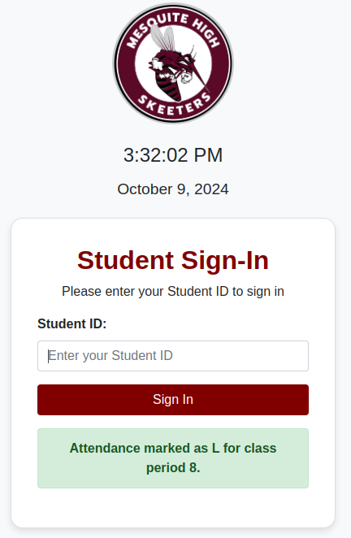
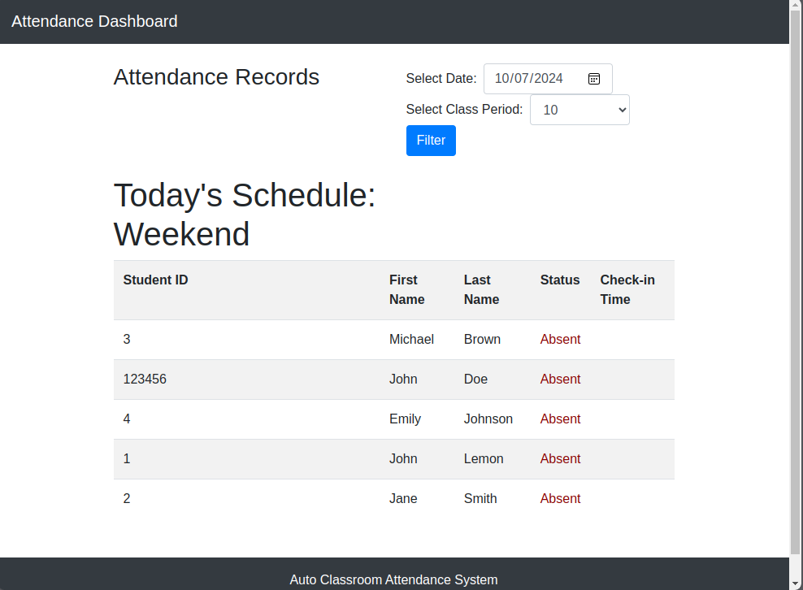

# Auto Classroom Attendance

An automated system for tracking student attendance using barcode scanners.

## Overview

This web-based application streamlines the process of recording student attendance. Students can sign in by scanning their ID cards with a generic barcode scanner. The system automatically updates attendance status based on arrival time:

- Present: On time
- Tardy: Less than 10 minutes late
- Late: Between 10 and 45 minutes late
- Absent: More than 45 minutes late or not signed in

## Screenshots

*Student Sign-in Page*

*Teacher's Attendance Dashboard*

## Features

- Automatic attendance tracking
- Real-time status updates
- Support for block scheduling
- User-friendly interface

## Getting Started

### Prerequisites

- Web server (e.g., Apache)
- PHP
- MariaDB

### Installation

1. Clone the repository into your web server directory:
git clone https://github.com/jkubala4454/Auto-Classroom-Attendance.git

2. Configure your web server to serve the application
3. Using MariaDB command line or PHPAdmin, create the database attendance_db
4. Import /includes/attendance_db.sql into your new database
5. Edit /includes/students_with_classes.csv to reflect your students or leave the demo data
6. Import the students using /includes/import_students.php
7. Update the class_schedule table to reflect your school schedule.  Time is in 24h format.

## Usage

Navigate to `public/index.html` on your web browser to access the student sign-in page.
Navigate to `public/login.php` on your web browser to access the login for the teacher dashboard.

## Deployment

**Note:** This project is currently in development and not ready for production deployment.

## Built With

- [Visual Studio Code](https://code.visualstudio.com/)
- [Apache](https://httpd.apache.org/)
- [PHP](https://www.php.net/)
- [MariaDB](https://mariadb.org/)

## Contributing

We welcome contributions to improve this project. Please feel free to submit pull requests or open issues with your ideas and suggestions.

## Versioning

We use [SemVer](http://semver.org/) for versioning. 

### Version History

See https://github.com/jkubala4454/Auto-Classroom-Attendance/releases

## Authors

- **John Kubala** - *Initial work* - [jkubala4454](https://github.com/jkubala4454)

## License

This project is licensed under the GPL License - see the [LICENSE.md](LICENSE.md) file for details.

## Acknowledgments

- Dedicated to all the overwhelmed teachers trying to simplify their daily tasks.

---

**Note:** This is a work in progress. Feedback and contributions are greatly appreciated as we strive to make this tool more useful for educators.
